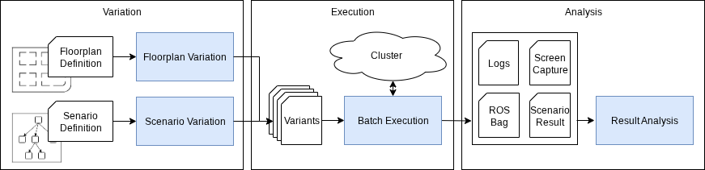

# RoboVAST

Variation Automation and Scalable Testing for Robotic Systems.

> **Disclaimer:** RoboVAST is currently being released. The source code and resources are being published progressively until our presentation at [ROSCon DE 2025](https://roscon.ros.org/de/2025/).

**RoboVAST** is an open-source framework for automated, large-scale integration testing of robotic software in simulated environments. Built upon proven foundations including the Floorplan-DSL for parameterizable indoor environment generation, scenario-execution for single test execution, and Kubernetes for orchestration, RoboVAST enables developers to systematically validate their systems across thousands of varied test scenarios.

See the full documentation at [https://cps-test-lab.github.io/robovast/](https://cps-test-lab.github.io/robovast/).
