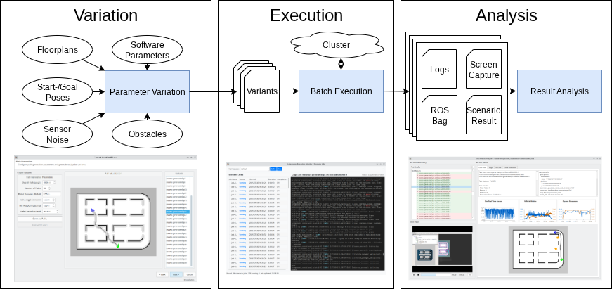

========
RoboVAST
========

*Variation Automation and Scalable Testing for Robotic Systems*

**RoboVAST** is an open-source framework for automated, large-scale integration testing of robotic software in simulated environments. Built upon proven foundations including the Floorplan-DSL for parameterizable indoor environment generation, scenario-execution for single run execution, and Kubernetes for orchestration, RoboVAST enables developers to systematically validate their systems across thousands of varied run scenarios.

**Mobile robot navigation serves as our primary use case**, focusing on indoor environments where robots must navigate with varying layouts, tasks, obstacles, navigation parameters and environmental conditions. This foundational application demonstrates RoboVAST's core capabilities while providing immediate value to the mobile robotics community.

RoboVAST provides a **comprehensive dataset** designed to test multiple aspects of **mobile robot software** like Nav2, including localization, path planning, obstacle avoidance, and dynamic re-planning. This reference dataset can be used out-of-the-box or adapted to specific user requirements, significantly lowering the barrier to robust robotics testing.

Framework Architecture
======================

Variation
---------

RoboVAST combines multiple variation dimensions to generate comprehensive run suites. Environment generation uses the Floorplan-DSL to describe and generate diverse 3D indoor environments with parametric variation of room dimensions and connectivity. For systematic variation, it combines parameters specific to the use case, such as start/end poses, obstacle configurations, and sensor noise for mobile robot navigation. The modular architecture supports extensible addition of new variation dimensions based on specific application requirements.

Execution
---------

RoboVAST orchestrates run execution by creating Kubernetes jobs that run individual robot simulations using scenario-execution, including screen capturing and ROS bag data collection. The platform handles parallel deployment across available cluster nodes along with required input and output data management. This architecture enables execution of multiple runs in parallel depending on cluster size, significantly reducing validation time while ensuring reproducible execution across distributed computational environments.

Data & Evaluation
-----------------

To support data processing and evaluation of run results, the framework provides tools with automated postprocessing, trajectory visualization, and log analysis of each run. These tools offer fundamental capabilities including performance metric extraction, failure detection, and visual inspection of robot behavior.

For use case-specific evaluation requirements, users can implement custom evaluation workflows. The framework includes examples for further evaluation workflows, enabling users to perform domain-specific evaluation using their preferred analysis tools and methodologies.

Mobile Robot Reference Dataset
==============================

The RoboVAST dataset for mobile robots comprises thousands of mobile robot navigation tests conducted in Gazebo with ROS2 across diverse indoor environments and conditions.

The dataset serves as a comprehensive validation tool for navigation stacks such as Nav2, enabling developers to identify fundamental issues such as incorrect parameterization, setup problems, or software bugs. By testing their Nav2 configuration against the reference dataset, users can quickly assess system correctness and evaluate overall performance characteristics.

.. toctree::
   :maxdepth: 2
   :caption: Contents:

   setup
   how_to_run
   configuration
   example
   variation
   cluster_execution
   results_processing
   evaluation
   developer_guide
